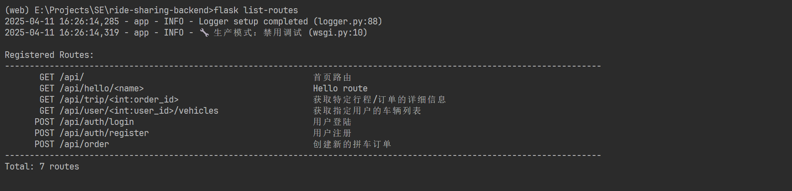

[TOC]

## 一、后端项目运行

首先需要自行添加  `.env` 在项目根目录：


内容如下（需要根据自己的Mysql配置进行调整）：

```
# 基础配置
SECRET_KEY=your-secret-key-here
JWT_SECRET_KEY=your-jwt-secret-key-here

# 数据库配置 MySQL
DATABASE_URL=mysql+pymysql://用户名:密码@localhost:端口(3306)/数据库名称
DEV_DATABASE_URL=mysql+pymysql://用户名:密码@localhost:端口(3306)/数据库名称
TEST_DATABASE_URL=mysql+pymysql://用户名:密码@localhost:端口(3306)/数据库名称
PROD_DATABASE_URL=mysql+pymysql://用户名:密码@localhost:端口(3306)/数据库名称
```

- 开发环境

```bash
flask run --debug
```

- 生产环境

```bash
flask run
```

- 使用局域网

```bash
flask run --host=0.0.0.0 --debug
```

**项目结构：**


## 二、后端自定义命令行指令CLI -- `/app/command.py`

### 1. `flask init-db`

功能：根据model层定义的模型类（`db.Model`）初始化数据库（**注：无法覆盖已经建立的表，需要先删除才可以重新创建**）。


### 2. `flask drop-tables <--force>`

功能：删除数据库，`<--force>`表示**是否为强制删除**。


### 3. `flask list-routes`

功能：将所有定义的端口（endpoint）及其注释打印出来。




## 三、后端日志记录 -- `/app/utils/logger.py`

## 四、前端封装http请求 -- `/utils/request.js`

```js
/**
 * @file 网络请求(request)工具库
 * @description 封装了uni-app的请求方法，提供以下功能：
 * 1. 自动添加基础URL和认证Token
 * 2. 统一的请求/响应拦截器
 * 3. 快捷的HTTP方法封装（GET/POST/PUT/DELETE）
 * 
 * @example 基本使用
 * import { get, post } from '@/utils/request'
 * 
 * // GET请求
 * get('/api/user').then(res => {...})
 * 
 * // POST请求
 * post('/api/login', {username, password}).then(res => {...})
 * 
 * // 文件上传
 * upload('/api/upload', filePath).then(res => {...})
 */
```

## 五、 HTTP状态码与业务状态码

### HTTP状态码（由网络层返回）

前端通过`res.statusCode`获取，通常表示请求的基本状态：

| 状态码 |          含义          |     使用场景     |
| :----: | :--------------------: | :--------------: |
|  200   |      **请求**成功      | 接口正常返回数据 |
|  401   | 未授权（Unauthorized） |    Token失效     |
|  403   | 禁止访问（Forbidden）  |  Token权限不足   |
|  500   |     服务器内部错误     |   后端代码异常   |

```js
// 后端发送
return jsonify({...}), 200  # HTTP状态码200（成功）

// 前端检测
if (res.statusCode === 401) {
  // 处理Token失效
}
```

### 业务状态码（由后端自定义）

前端通过`res.data.code`获取，表示具体的业务逻辑状态：

| 状态码 |       含义       |             示例响应格式             |
| :----: | :--------------: | :----------------------------------: |
|  200   | **业务逻辑**成功 |     `{ code: 200, data: {...} }`     |
|  401   |      未授权      |  `{ code: 401, message: "请登录" }`  |
|  403   |      无权限      |  `{ code: 403, message: "无权限" }`  |
|  500   |     业务异常     | `{ code: 500, message: "服务异常" }` |

```js
// 后端发送
return jsonify({
    "code": 200,  # 业务状态码200（业务成功）
    "message": "登录成功",
    ...
}), 200

// 前端检测
if (res.data?.code === 401) {
  // 处理业务层面的未授权
}
```

## 六、 接口规范

根据对上面状态码的理解，后端响应代码尽可能规范以便于前端进行统一的处理：

```python
# 成功响应
return jsonify({
    "code": 200,       # 业务成功
    "data": {...}      # 业务数据
}), 200                # HTTP成功

# 业务失败（如密码错误）
return jsonify({
    "code": 40001,     # 自定义业务错误码
    "message": "密码错误"
}), 200                # HTTP仍然返回200

# 系统级错误（如数据库崩溃）
return jsonify({
    "code": 500,
    "message": "系统繁忙"
}), 500                # HTTP状态码同步为500
```

## 七、 前端修改部分 -- 将`request`分离


## 可以先将接口定义出来 再往里面填函数


